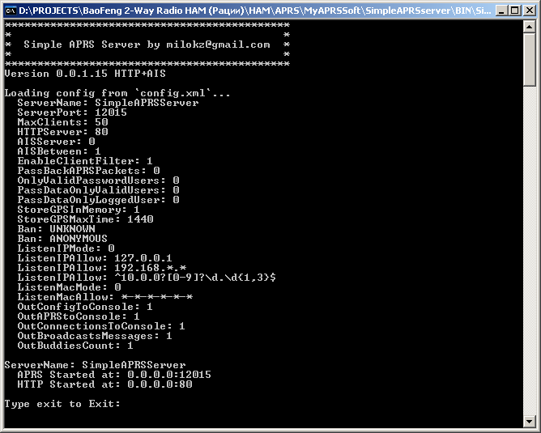

# Simple APRS Server

Это простой APRS сервер, который
позволяет обмениваться данными между
всеми подключенными к нему клиентами.
Позволяет кэшировать и хранить последние 
полученные координаты и выдавать их при
входящем подключении.

Сервер имеет HTTP интерфейс с картой и 
статистикой.

Поддерживается AIS протокол.

Поддерживает стандартные фильтры клиентов:
    r/lat/lon/dist -- Range filter 
    p/aa/bb/cc -- Prefix filter  
    b/call1/call2 -- Budlist filter 
    o/call1/call2 -- Object filter 
    os/call1/call2 -- Strict Object filter
    t/poimqstuw/call/km -- Type filter
    s/pri/alt/over -- Symbol filter 
    d/digi1/digi2 -- Digipeater filter
    a/latN/lonW/latS/lonE -- Area filter 
    e/call1/call2 -- Entry station filter
    g/call1/call2 -- Group Message filter 
    u/call1/call2 -- Unproto filter
    m/dist -- My Range filter
    f/user/dist --	Friend Range filter 
	
Клиентский софт:
  YAAC
  
  Windows:
	UI-View32

  Android:
	OruxMaps
	APRSDroid

===============================================

This is the Simple APRS Server
wich send received data to all 
connected users.

Has HTTP interface with live Map.

Support AIS protocol.

Supporting client filters:
    r/lat/lon/dist -- Range filter 
    p/aa/bb/cc -- Prefix filter  
    b/call1/call2 -- Budlist filter 
    o/call1/call2 -- Object filter 
    os/call1/call2 -- Strict Object filter
    t/poimqstuw/call/km -- Type filter
    s/pri/alt/over -- Symbol filter 
    d/digi1/digi2 -- Digipeater filter
    a/latN/lonW/latS/lonE -- Area filter 
    e/call1/call2 -- Entry station filter
    g/call1/call2 -- Group Message filter 
    u/call1/call2 -- Unproto filter
    m/dist -- My Range filter
    f/user/dist --	Friend Range filter 

Client Software:	
  YAAC
  
  Windows:
	UI-View32

  Android:
	OruxMaps
	APRSDroid

